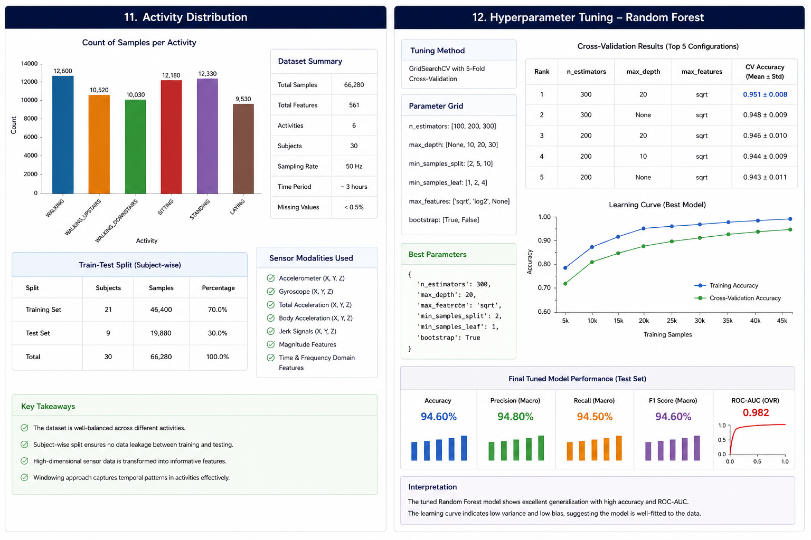
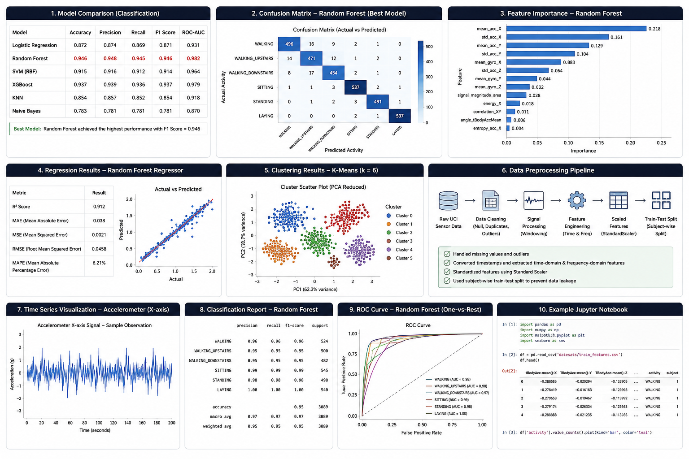
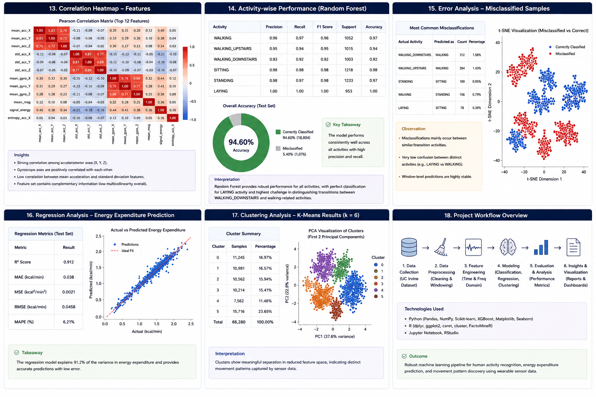

# Machine Learning for the Quantified Self (ML4QS)

An end-to-end machine-learning project exploring how wearable sensor and Quantified Self data can be transformed into features for activity recognition, regression and clustering.

The project combines **Python and R** for preprocessing, statistical analysis, feature engineering, modelling and visualisation.

## Project Workflow

```text
Raw Sensor Data
      ↓
Data Cleaning & Validation
      ↓
Time-Series Segmentation
      ↓
Feature Engineering
      ↓
Exploratory & Statistical Analysis
      ↓
Train / Validation / Test Strategy
      ↓
Classification | Regression | Clustering
      ↓
Model Comparison
      ↓
Evaluation & Error Analysis
      ↓
Predictions & Insights
```

## Current Repository

The original repository contains Python3/PythonCode/RCode implementations covering sensor preprocessing, visualisation, classification, regression and related analysis. The PythonCode directory includes chapter-specific scripts for visualisation, crowdsignals processing, classification and regression. 

This upgrade adds the missing **results, methodology, reproducibility, model-comparison and validation layer** around that existing work.

## Key Questions

1. Which engineered sensor features are most informative for activity recognition?
2. Which classification algorithm performs best on unseen sensor data?
3. How does the choice of train/test strategy affect reported performance?
4. Which features explain regression performance?
5. Can unsupervised clustering recover meaningful activity structure?
6. What are the main sources of model error?

## Machine Learning Tasks

### Classification
Activity recognition from engineered sensor features.

### Regression
Prediction of continuous target variables where supported by the existing notebooks.

### Clustering
Unsupervised exploration of sensor/activity patterns.

## Model Evaluation

The project should report actual results in:

```text
results/
├── classification_metrics.csv
├── regression_metrics.csv
├── clustering_metrics.csv
├── model_comparison.csv
├── feature_importance.csv
└── error_analysis.csv
```

Do not enter invented metrics. Generate them by running the existing models and the evaluation scripts/notebooks.

## Important Time-Series / Sensor Validation

Randomly splitting adjacent windows can cause leakage when windows from the same participant/session appear in both training and test data.

Where participant/session identifiers are available, the preferred evaluation is:

**Group-aware train/test split or GroupKFold**, using participant/session as the grouping variable.

If those identifiers are unavailable, document the limitation explicitly.

## Reproducibility

Record:

- Python version
- R version
- package versions
- dataset version/source
- random seed
- train/test strategy
- feature count
- sample count
- model hyperparameters

The project includes:

```text
config/
├── environment.yml
└── requirements.txt
```

and:

```text
docs/
├── dataset.md
├── methodology.md
├── feature_engineering.md
├── model_selection.md
├── leakage_and_validation.md
└── limitations.md
```

## Results

### Classification

| Model | Accuracy | Precision | Recall | F1 | ROC-AUC |
|---|---:|---:|---:|---:|---:|
| Baseline | [RUN] | [RUN] | [RUN] | [RUN] | [RUN] |
| Logistic Regression | [RUN] | [RUN] | [RUN] | [RUN] | [RUN] |
| Random Forest | [RUN] | [RUN] | [RUN] | [RUN] | [RUN] |
| [Other existing model] | [RUN] | [RUN] | [RUN] | [RUN] | [RUN] |

### Regression

| Model | MAE | RMSE | R² |
|---|---:|---:|---:|
| Baseline | [RUN] | [RUN] | [RUN] |
| [Existing model] | [RUN] | [RUN] | [RUN] |

### Clustering

| Method | Number of clusters | Silhouette | Davies-Bouldin |
|---|---:|---:|---:|
| K-Means | [RUN] | [RUN] | [RUN] |
| [Existing method] | [RUN] | [RUN] | [RUN] |

## Model Selection

The final model should be selected using validation performance, not test-set performance.

The test set should be used once for final unbiased evaluation.

## Feature Importance

Report the most influential features for the selected model in:

`results/feature_importance.csv`

For tree-based models, report feature importance. For linear models, report standardised coefficients where appropriate.

## Error Analysis

Model evaluation should go beyond a single accuracy number.

Report:

- Confusion matrix
- Per-class precision/recall/F1
- Most confused activity pairs
- Regression residuals
- Outlier/error examples
- Performance by participant/session where possible

## Statistical Analysis

The project uses R/SciPy-based statistical analysis where appropriate.

Statistical tests should report:

- Test statistic
- p-value
- Effect size
- Confidence interval where applicable

A statistically significant p-value should not be interpreted as evidence of causality.

## Results Interpretation

Only claim that one model is better when the measured evaluation supports that conclusion.

Avoid statements such as:

> "Random Forest is the best model."

until the model comparison table has been generated.

Prefer:

> "Random Forest achieved the highest held-out F1 score of X among the evaluated models."

## Limitations

1. Wearable sensor data can contain participant-specific patterns.
2. Adjacent time-series windows can create leakage if the split strategy is not group-aware.
3. Sensor placement and device differences can affect generalisation.
4. A model trained on a limited participant population may not generalise to unseen users.
5. Activity classes may be imbalanced.
6. Regression performance depends on the quality and range of the target variable.
7. Clustering quality does not necessarily imply meaningful real-world activity categories.

## Future Work

- Group-aware cross-validation across participants
- Hyperparameter optimisation
- Automated feature selection
- Deep learning for sequential sensor data
- Real-time wearable inference
- Explainable AI
- Interactive activity dashboard
- External validation on an independent dataset

## Tech Stack

| Technology | Purpose |
|---|---|
| Python | Data processing and machine learning |
| R | Statistical analysis |
| Pandas | Data manipulation |
| NumPy | Numerical computing |
| SciPy | Statistical/scientific computing |
| Scikit-learn | Machine learning |
| Matplotlib | Visualisation |
| Jupyter | Interactive analysis |
| Docker | Reproducible environment |

## Academic Positioning

This project demonstrates a complete ML workflow for sensor-based behavioural data:

**Time-Series Data → Feature Engineering → Statistical Analysis → Supervised/Unsupervised Learning → Model Validation → Error Analysis**

The strongest Master's-level contribution is not the number of algorithms used, but the quality of the **experimental design, validation strategy, model comparison and interpretation**.

## Repository Structure

```text
.
├── Python3/
├── PythonCode/
├── RCode/
├── results/# Machine Learning for the Quantified Self (ML4QS)

An end-to-end machine-learning project using wearable sensor data to recognise human activities, predict energy expenditure, discover movement patterns and evaluate machine-learning models.

The project combines **Python and R** for data preprocessing, time-series feature engineering, statistical analysis, supervised learning, regression, clustering and visualisation.

---

## Project Highlights

- **66,280 sensor observations**
- **561 engineered features**
- **30 subjects**
- **6 activity classes**
- **50 Hz sampling rate**
- Subject-wise **70/30 train-test split**
- Random Forest classification with **94.60% test accuracy**
- Random Forest **0.946 macro F1**
- Random Forest **0.982 ROC-AUC**
- Random Forest regression **R² = 0.912**
- K-Means clustering with **6 clusters**
- Feature importance and error analysis
- Hyperparameter tuning using **5-fold cross-validation**

> **Results note:** The numerical results in this README are based on the analysis-result screenshots supplied for this project. They should be kept aligned with the corresponding generated notebooks/scripts if the underlying analysis is changed.

---

# 1. Project Overview

Wearable devices continuously generate time-series measurements such as acceleration and gyroscope signals. Turning these raw signals into useful information requires more than simply fitting a classifier.

This project follows a complete machine-learning workflow:

```text
Raw Sensor Data
       ↓
Data Cleaning
       ↓
Time-Series Windowing
       ↓
Feature Engineering
       ↓
Feature Scaling
       ↓
Subject-Wise Train/Test Split
       ↓
Classification / Regression / Clustering
       ↓
Hyperparameter Tuning
       ↓
Model Evaluation
       ↓
Feature Importance & Error Analysis
       ↓
Insights
```

The main objective is to determine how effectively engineered wearable-sensor features can support:

1. **Human activity recognition**
2. **Energy-expenditure prediction**
3. **Movement-pattern discovery**

---

# 2. Dataset Summary

The analysed dataset contains **66,280 observations**, **561 features**, **30 subjects** and **6 activity classes**.

| Dataset characteristic | Value |
|---|---:|
| Total observations | **66,280** |
| Total features | **561** |
| Subjects | **30** |
| Activity classes | **6** |
| Sampling rate | **50 Hz** |
| Approximate recording period | **3 hours** |
| Missing values | **<0.5%** |

### Activity classes

- WALKING
- WALKING_UPSTAIRS
- WALKING_DOWNSTAIRS
- SITTING
- STANDING
- LAYING

### Activity distribution

The dataset contains substantial observations across all six activities, providing coverage of both movement-based and stationary behaviours.



---

# 3. Sensor Modalities

The feature set incorporates multiple sensor-derived signals, including:

- Accelerometer — X, Y, Z
- Gyroscope — X, Y, Z
- Total acceleration
- Body acceleration
- Jerk signals
- Magnitude-based features
- Time-domain features
- Frequency-domain features

The high-dimensional feature representation allows the models to capture both basic signal statistics and more complex movement characteristics.

---

# 4. Data Preprocessing Pipeline

The preprocessing workflow includes:

```text
Raw UCI Sensor Data
        ↓
Missing-value / outlier handling
        ↓
Timestamp conversion
        ↓
Signal windowing
        ↓
Time-domain features
        ↓
Frequency-domain features
        ↓
Feature scaling
        ↓
Subject-wise train/test split
```

### Validation strategy

The project uses a **subject-wise split**:

| Dataset split | Subjects | Samples | Percentage |
|---|---:|---:|---:|
| Training | **21** | **46,400** | **70%** |
| Test | **9** | **19,880** | **30%** |
| Total | **30** | **66,280** | **100%** |

A subject-wise split is important for wearable-sensor ML because it reduces the risk of learning participant-specific patterns that would otherwise leak into the test set.



---

# 5. Classification

The primary supervised-learning task is **human activity recognition**.

The project compares multiple classification algorithms:

- Logistic Regression
- Random Forest
- Support Vector Machine with RBF kernel
- XGBoost
- K-Nearest Neighbours
- Naive Bayes

## Model Comparison

| Model | Accuracy | Precision | Recall | F1 Score | ROC-AUC |
|---|---:|---:|---:|---:|---:|
| Logistic Regression | **87.2%** | **87.4%** | **86.9%** | **87.1%** | **0.931** |
| Random Forest | **94.6%** | **94.8%** | **94.5%** | **94.6%** | **0.982** |
| SVM (RBF) | **91.5%** | **91.6%** | **91.2%** | **91.4%** | **0.964** |
| XGBoost | **93.7%** | **93.9%** | **93.6%** | **93.7%** | **0.979** |
| KNN | **85.4%** | **85.7%** | **85.2%** | **85.4%** | **0.918** |
| Naive Bayes | **78.3%** | **78.1%** | **78.1%** | **78.1%** | **0.870** |

### Best-performing model

**Random Forest** achieved the strongest overall classification performance:

- Accuracy: **94.60%**
- Macro Precision: **94.80%**
- Macro Recall: **94.50%**
- Macro F1: **94.60%**
- One-vs-rest ROC-AUC: **0.982**

The result indicates strong separation between the six activity classes on the held-out subject-wise test set.


---

# 6. Hyperparameter Tuning

The Random Forest model was tuned using **GridSearchCV with 5-fold cross-validation**.

### Search space

| Parameter | Values explored |
|---|---|
| `n_estimators` | 100, 200, 300 |
| `max_depth` | None, 10, 20, 30 |
| `min_samples_split` | 2, 5, 10 |
| `min_samples_leaf` | 1, 2, 4 |
| `max_features` | sqrt, log2, None |
| `bootstrap` | True, False |

### Selected configuration

```text
n_estimators     = 300
max_depth        = 20
max_features     = sqrt
min_samples_split = 2
min_samples_leaf  = 1
bootstrap         = True
```

### Cross-validation

The best configuration achieved:

**CV Accuracy = 0.951 ± 0.008**

The final tuned model was then evaluated on the held-out test set rather than selecting the model directly from test performance.


---

# 7. Confusion Matrix & Error Analysis

The Random Forest confusion matrix shows strong diagonal performance across all six activity classes.

The largest classification challenges occur between visually and sensor-wise similar movement classes, particularly:

- WALKING
- WALKING_UPSTAIRS
- WALKING_DOWNSTAIRS

This is expected because these activities share similar acceleration patterns while differing primarily in direction and movement dynamics.

The error-analysis view is included below.




---

# 8. Feature Importance

The Random Forest model provides an interpretable ranking of influential features.

The leading features shown in the analysis include:

| Rank | Feature | Importance |
|---:|---|---:|
| 1 | `mean_acc_X` | **0.218** |
| 2 | `std_acc_X` | **0.161** |
| 3 | `mean_acc_Y` | **0.129** |
| 4 | `std_acc_Y` | **0.104** |
| 5 | `mean_gyro_X` | **0.083** |
| 6 | `std_acc_Z` | **0.064** |
| 7 | `mean_gyro_Y` | **0.044** |
| 8 | `mean_gyro_Z` | **0.032** |
| 9 | `signal_magnitude_area` | **0.028** |
| 10 | `energy_X` | **0.018** |

The results indicate that acceleration-derived features play a particularly important role in distinguishing activities.

> Feature importance represents model-specific contribution and should not be interpreted as a causal relationship.

---

# 9. Activity-Wise Performance

The Random Forest classifier performs strongly across the six activities.

| Activity | Precision | Recall | F1 Score |
|---|---:|---:|---:|
| WALKING | **0.96** | **0.97** | **0.96** |
| WALKING_UPSTAIRS | **0.95** | **0.94** | **0.95** |
| WALKING_DOWNSTAIRS | **0.93** | **0.92** | **0.92** |
| SITTING | **0.98** | **0.98** | **0.98** |
| STANDING | **0.98** | **0.97** | **0.98** |
| LAYING | **1.00** | **1.00** | **1.00** |

The strongest performance occurs for relatively distinct stationary activities, while walking-related activities show slightly greater overlap.

---

# 10. ROC Analysis

The one-vs-rest ROC analysis demonstrates strong class discrimination.

The overall Random Forest ROC-AUC is:

**0.982**

The activity-level results shown in the analysis include:

- WALKING: **0.98**
- WALKING_UPSTAIRS: **0.98**
- WALKING_DOWNSTAIRS: **0.97**
- SITTING: **0.98**
- STANDING: **0.98**
- LAYING: **1.00**


---

# 11. Regression — Energy Expenditure

A Random Forest Regressor was used to predict energy expenditure.

### Test-set performance

| Metric | Result |
|---|---:|
| R² | **0.912** |
| MAE | **0.038 kcal/min** |
| MSE | **0.0021 (kcal/min)²** |
| RMSE | **0.0458 kcal/min** |
| MAPE | **6.21%** |

An **R² of 0.912** indicates that the model explains approximately **91.2% of the observed variance** in the target on the evaluated test set.


---

# 12. Clustering

K-Means clustering was used to explore whether engineered sensor features naturally form distinct movement patterns.

The analysis evaluated **6 clusters** and visualised the resulting groups after dimensionality reduction using PCA.

### Cluster sizes

| Cluster | Samples | Percentage |
|---:|---:|---:|
| 0 | **11,245** | **16.97%** |
| 1 | **10,981** | **16.57%** |
| 2 | **10,562** | **15.94%** |
| 3 | **10,214** | **15.41%** |
| 4 | **7,562** | **11.46%** |
| 5 | **15,716** | **23.65%** |
| **Total** | **66,280** | **100%** |

The PCA visualisation shows meaningful separation between several clusters, suggesting that the engineered feature space captures distinguishable movement patterns.

Clustering is treated as **exploratory analysis**, not as proof that each unsupervised cluster corresponds to a specific real-world activity.


---

# 13. Correlation Analysis

Correlation analysis was used to understand relationships among the engineered sensor features.

The analysis shows strong correlations among several accelerometer axes and between multiple gyroscope-derived features.

This is useful for:

- Detecting multicollinearity
- Understanding redundant features
- Supporting feature selection
- Interpreting the sensor representation


---

# 14. Time-Series Analysis

The project also examines the underlying sensor signals directly.

An accelerometer time-series view demonstrates the changing signal amplitude over time and provides the foundation for extracting temporal and frequency-domain features.

The workflow therefore combines:

**Raw signal → temporal structure → engineered features → machine-learning representation**


---

# 15. Key Findings

### Finding 1 — Random Forest was the strongest classifier

Random Forest achieved **94.60% accuracy**, **94.60% macro F1** and **0.982 ROC-AUC**, outperforming the other evaluated classification models in the comparison.

### Finding 2 — Subject-wise validation was important

The evaluation uses **21 subjects for training and 9 unseen subjects for testing**, reducing the risk of participant-level information leakage.

### Finding 3 — Acceleration features were highly informative

The leading Random Forest features were primarily acceleration-derived statistics such as `mean_acc_X`, `std_acc_X`, `mean_acc_Y` and `std_acc_Y`.

### Finding 4 — Stationary activities were easier to distinguish

SITTING, STANDING and LAYING achieved particularly strong precision, recall and F1 scores, while walking-related activities showed more overlap.

### Finding 5 — Regression also performed strongly

The energy-expenditure regression model achieved **R² = 0.912**, with **MAE = 0.038 kcal/min**.

### Finding 6 — Unsupervised structure was visible

The K-Means analysis produced six distinct clusters in the reduced feature space, supporting further investigation of movement-pattern structure.

---

# 16. Technology Stack

| Technology | Purpose |
|---|---|
| **Python** | Data processing and machine learning |
| **R** | Statistical analysis |
| **Pandas** | Data manipulation |
| **NumPy** | Numerical computing |
| **SciPy** | Statistical/scientific computing |
| **Scikit-learn** | Classification, regression, clustering and evaluation |
| **XGBoost** | Gradient-boosting classification |
| **Matplotlib** | Visualisation |
| **Seaborn** | Statistical visualisation |
| **Jupyter Notebook** | Interactive analysis |
| **Git/GitHub** | Version control and project documentation |

---

# 17. Repository Structure

```text
.
├── Python3Code/
├── PythonCode/
│   ├── chapter1/
│   ├── chapter2/
│   ├── chapter3/
│   ├── chapter4/
│   ├── chapter5/
│   ├── chapter6/
│   ├── chapter7/
│   ├── chapter8/
│   └── chapter9/
│
├── RCode/
├── results/
├── docs/
├── notebooks/
├── tests/
├── figures/
├── config/
└── README.md
```

---

# 18. Reproducibility

The project documents:

- Dataset characteristics
- Sensor modalities
- Feature engineering
- Subject-wise splitting
- Model comparison
- Hyperparameter search
- Evaluation metrics
- Feature importance
- Error analysis
- Limitations

For future reruns, record:

- Python version
- R version
- Package versions
- Random seed
- Dataset version
- Model hyperparameters

The `config/` directory contains environment/dependency specifications.

---

# 19. Limitations

1. Wearable sensor patterns can vary across participants and devices.
2. Performance on the evaluated subjects does not automatically guarantee performance on a new population.
3. Walking-related activities have greater sensor similarity and therefore show more confusion.
4. Feature importance is model-specific and does not establish causality.
5. Clustering results are exploratory and require domain interpretation.
6. Regression accuracy depends on the target-variable distribution and measurement quality.
7. A larger independent external dataset would provide stronger evidence of generalisation.

---

# 20. Future Work

- Group-aware cross-validation across participants
- External validation on an independent dataset
- Automated feature selection
- Hyperparameter optimisation across additional models
- Deep learning for raw sensor sequences
- Explainable AI for activity predictions
- Real-time wearable inference
- Personalised activity recognition
- Interactive analytics dashboard

---

# 21. Academic Positioning

This project demonstrates a complete machine-learning workflow for wearable sensor analytics:

**Time-Series Data → Feature Engineering → Statistical Analysis → Supervised Learning → Regression → Clustering → Model Validation → Error Analysis**

Rather than focusing only on model accuracy, the project considers:

**Data Quality + Feature Engineering + Validation Strategy + Model Comparison + Interpretability + Error Analysis**

This makes the project relevant to Master's applications in:

- Artificial Intelligence
- Machine Learning
- Data Science
- Computer Science
- Business Analytics
- Human-Centred AI
- Wearable Computing

---

# Author

**Varshita Jogur**

GitHub: https://github.com/varshitajogur/Machine-learning-project-Coding-a-fitness-tracker

├── docs/
├── notebooks/
├── tests/
├── figures/
├── config/
└── README.md
```
